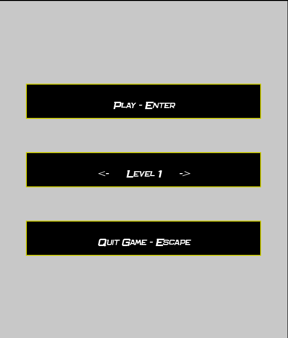

```                                                                                   
   ,---,                      ,-.                                                       
  '  .' \                 ,--/ /|                                    ,--,         ,---, 
 /  ;    '.      __  ,-.,--. :/ |                  ,---,    ,---.  ,--.'|       ,---.'| 
:  :       \   ,' ,'/ /|:  : ' /               ,-+-. /  |  '   ,'\ |  |,        |   | : 
:  |   /\   \  '  | |' ||  '  /    ,--.--.    ,--.'|'   | /   /   |`--'_        |   | | 
|  :  ' ;.   : |  |   ,''  |  :   /       \  |   |  ,"' |.   ; ,. :,' ,'|     ,--.__| | 
|  |  ;/  \   \'  :  /  |  |   \ .--.  .-. | |   | /  | |'   | |: :'  | |    /   ,'   | 
'  :  | \  \ ,'|  | '   '  : |. \ \__\/: . . |   | |  | |'   | .; :|  | :   .   '  /  | 
|  |  '  '--'  ;  : |   |  | ' \ \," .--.; | |   | |  |/ |   :    |'  : |__ '   ; |:  | 
|  :  :        |  , ;   '  : |--'/  /  ,.  | |   | |--'   \   \  / |  | '.'||   | '/  ' 
|  | ,'         ---'    ;  |,'  ;  :   .'   \|   |/        `----'  ;  :    ;|   :    :| 
`--''                   '--'    |  ,     .-./'---'                 |  ,   /  \   \  /   
                                 `--`---'                           ---`-'    `----' 
```
# Project from the "Langages de Programmation 2" class at ULB in computer science (2024 - 2025)

The main menu:


The first level:


## General description
This project was developed in a university context, meaning that we students were precisely guided. It was implemented in C++ 
using the Model-View-Controller (MVC) design pattern. The goal was to apply what we learned during lectures, such as inheritance, 
singletons, OOP, and other concepts. The graphical library used is Allegro 5.

The program has two states. The first is the menu, where the user can choose a level to start. The second is the game, which the user 
enters once a level is selected and the "Enter" key is pressed.

## How to start up the program

### Dependencies

- C++17
- make
- Allegro 5

### Debian distros

- C++17
```sh
sudo apt install gcc
```

- Make
```sh
sudo apt install make
```

- Allegro 5
```sh
sudo apt install liballegro-ttf5-dev
```

### Compilation

In src directory, simply type "make".

### Execution

In src directory, type "./Arkanoid".